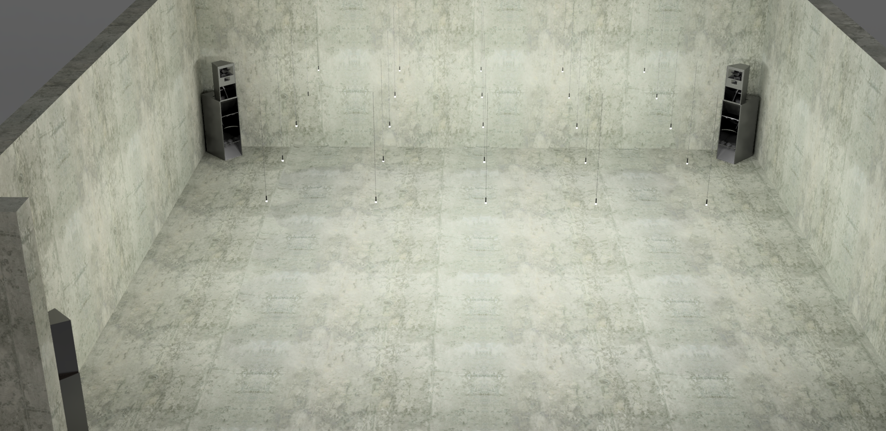
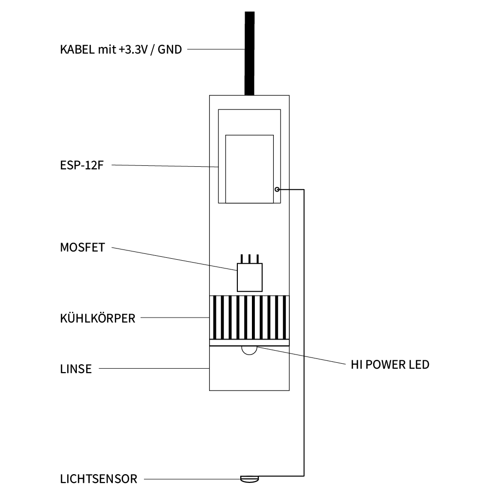
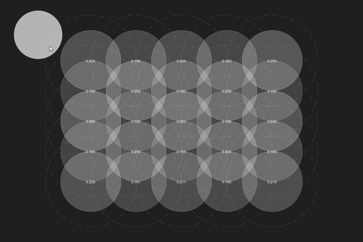
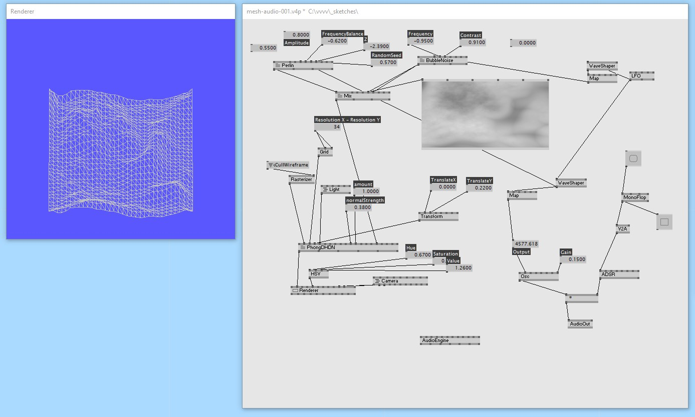
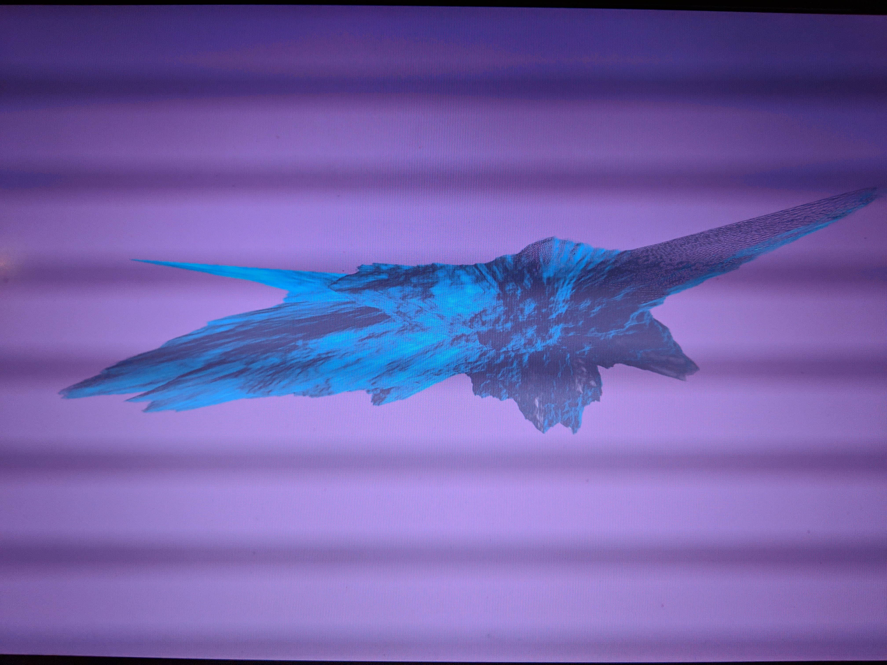

# master-thesis

repo for mt research

#dataviz #syn-aesthetics #data-driven #esp8266 #node #network #walkablesynthesis

#### Update: 06.01.2019

exhibiton setup / raumgestaltung: a grid of 5x5 modules hanging from the ceiling. each module consists of:

- esp8266 microntroller
- high power LED
- lens
- pvc tube as housing
- mosfet
- ldr sensor

module drawing

animation

---

#### Update: 05.01.2019

datastream received in vvvv is converted and send via OSC to max4live / ableton to control reaktor. visuals / projector skipped

---

#### Update: 03.01.2019

two esp8266 with LDR sensors on A0 pushing values with refresh rate of 50Hz in real-time via mqtt to broker in vvvv where values are feeding two sine wave oscillators

---

#### Update: 11.12.2018

added mqtt-broker server on local machine with esp8266 pushing messages to and vvvv receiving

---

#### Update: 6.12.2018

added sound engine on noise function

---

#### Update: 1.12.2018

first sketck in vvvv. grid / mesh + noise -> normal heightmap displacement

---
